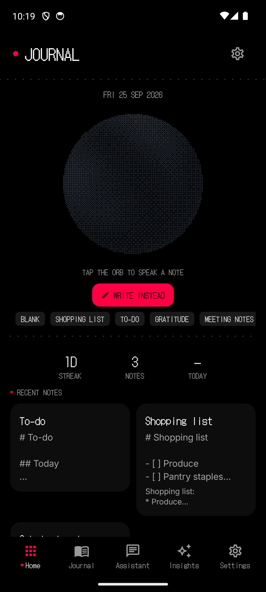
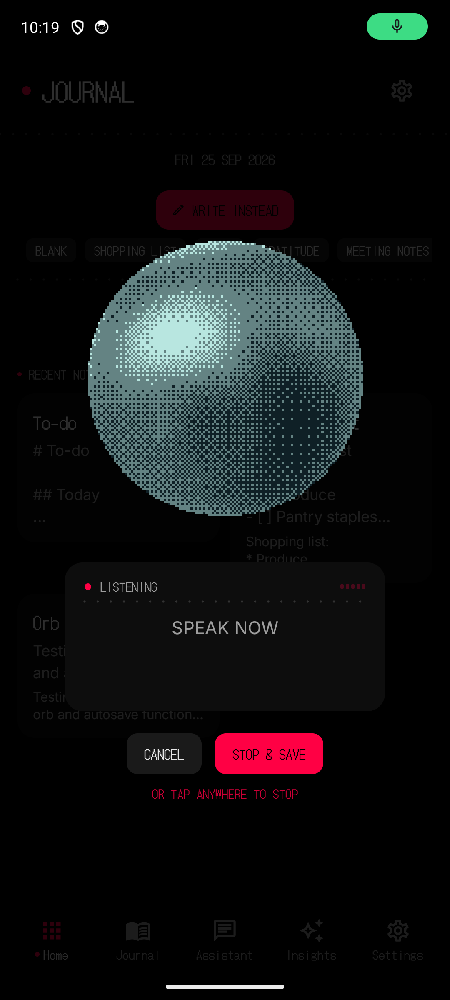
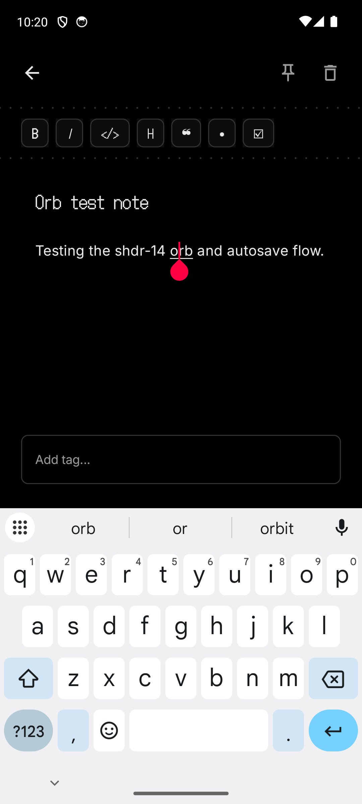
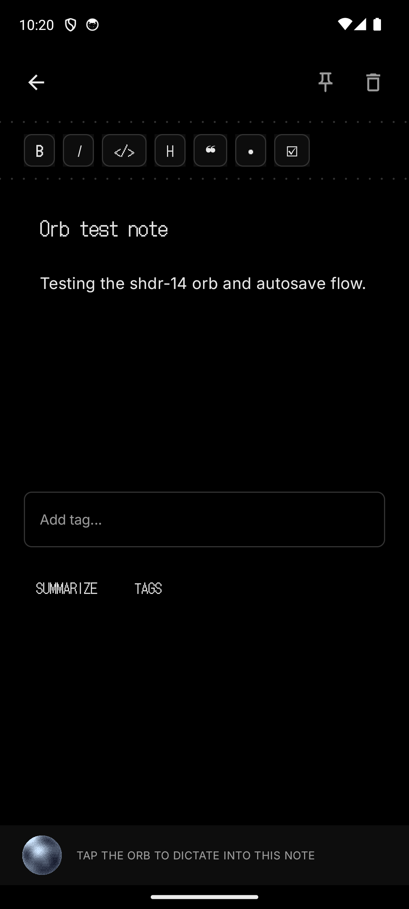
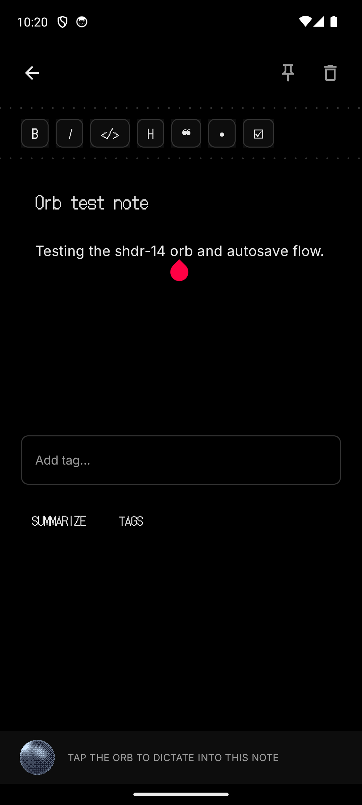
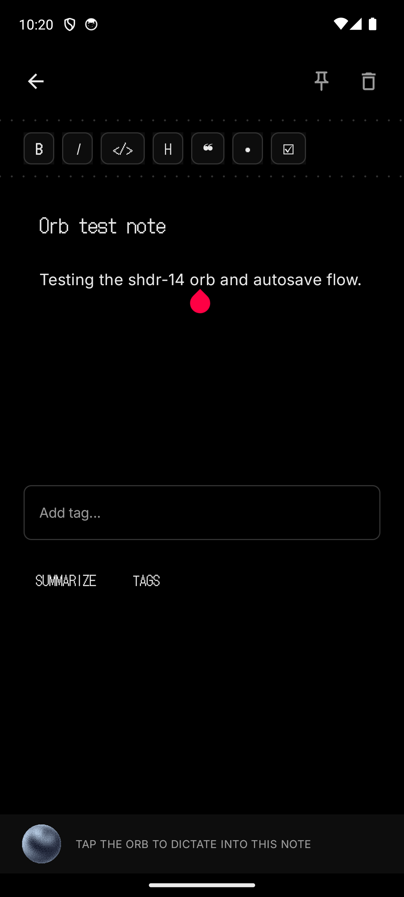

<div align="center">

# Nothing Journal

**A private, offline journal for Android — in NothingOS style.**

Dot-matrix type. Nothing Red on black. The shdr-14 shader orb as your voice
companion. And a **fully on-device AI stack**: the APK ships its own models
and declares **no INTERNET permission at all**.

[](https://kotlinlang.org)
[](https://developer.android.com/compose)
[](https://huggingface.co/litert-community/Gemma3-1B-IT)
[](https://github.com/ggml-org/whisper.cpp)
[]()
[]()
[](LICENSE)

</div>

---

## Highlights

- **Voice dictation, the Nothing way** — tap the orb and it *grows* into a
  dictation menu while your words appear live in a transcript card beneath
  it. Stop, and the transcript becomes a note. Whisper runs in-process; no
  audio ever leaves the device.
- **Live Markdown, Obsidian-style** — `# headings`, `**bold**`, `*italic*`,
  `` `code` ``, quotes, bullets and checkboxes all render actively in the
  editor while you type. The line your cursor sits on keeps its raw markers.
- **Real on-device intelligence** — Gemma 3 1B (int4) writes day summaries,
  reads moods and suggests tags. Summaries, moods and tags fall back to
  deterministic keyword logic, so the app stays fully functional without the
  model files.
- **Heat-conscious by design** — whisper uses `tiny.en` (~2–4× faster than
  base.en), Gemma loads lazily on first use and prefers the GPU backend with
  automatic CPU fallback.
- **Dense NothingOS UI** — a 240dp hero orb, template chips, streak/notes/
  mood stats, pinned and recent notes, a 30-day journal strip, insights
  charts — all edge-to-edge with proper system-bar insets.

## Screenshots

| Home | Dictation menu | Editor |
|---|---|---|
|  |  |  |

| Journal | Assistant | Insights |
|---|---|---|
|  |  |  |

## Privacy

The manifest declares **no INTERNET permission** — the OS itself guarantees
that no byte leaves the device. Concretely:

- Dictation audio is captured in-process (`AudioRecord` → vendored
  whisper.cpp via JNI) and never routed through any service the app adds.
- All entries, moods, tags and settings live in a local Room database and
  DataStore. Settings → **EXPORT MARKDOWN** writes a file wherever you point it.
- The platform `SpeechRecognizer` (offline when the ROM ships one) is only a
  fallback if the bundled whisper asset is missing.

## The orb

The centerpiece is a faithful Kotlin/GLSL port of the Orbkit
**shdr-14 “Dither”** shader by [zzzzshawn](https://github.com/zzzzshawn/orbkit)
(MIT): a demoscene sine-plasma on a rotating dome, quantized by an 8×8 Bayer
dither into chunky two-tone pixels. The orb is rendered by a custom
`TextureView` + EGL renderer (no `GLSurfaceView`), so it composites with
Compose transitions and never lingers after you change screens. Its state
machine (idle / listening / thinking / speaking / sleeping) is driven by the
orbkit spring-and-clock engine.

## Build from source

**Prerequisites:** JDK 17, Android SDK (compileSdk 34), NDK r27, CMake 3.22.1.

```bash
git clone https://github.com/YOUR_USERNAME/nothing-journal.git
cd nothing-journal

# 1. Fetch the bundled AI models (~605 MB total, one time)
./scripts/fetch-models.sh

# 2. Build
./gradlew assembleDebug        # APK at app/build/outputs/apk/debug/
./gradlew testDebugUnitTest    # 49 unit tests
```

`arm64-v8a` ships for phones; `x86_64` keeps the emulator path working.

> Prefer not to build? Grab the prebuilt APK (models bundled) from
> [Releases](../../releases).

### Release signing (maintainers)

Release builds are signed via a gitignored `keystore.properties` at the repo
root:

```properties
storeFile=nothingjournal-release.keystore
storePassword=…
keyAlias=nothingjournal
keyPassword=…
```

Generate a keystore with `keytool -genkeypair -v -keystore
nothingjournal-release.keystore -alias nothingjournal -keyalg RSA -keysize
4096 -validity 10950`, fill in the properties file, then `./gradlew
assembleRelease`. Both the keystore and the properties file are ignored by
git — keep the keystore safe: losing it means the release key can never be
reused. Without the properties file, release builds fall back to the debug
key so CI and fresh clones still produce installable APKs.

### Model files

| Job | Model | Size |
|---|---|---|
| Summaries · moods · tags · assistant | **Gemma 3 1B Instruct (int4)** — LiteRT task file via Google AI Edge / MediaPipe LLM Inference | ~530 MB |
| Voice dictation | **whisper.cpp `tiny.en`** — vendored, JNI bridge | ~75 MB |

Both land in `app/src/main/assets/ai/` (via `scripts/fetch-models.sh` or the
release assets) and are staged to app storage on first use. They are never
downloaded at runtime and never leave the device.

<details>
<summary>Manual download</summary>

```bash
# Gemma 3 1B Instruct, int4 (public LiteRT Community repo)
curl -L --fail -o app/src/main/assets/ai/gemma3-1b-it-int4.task \
  https://huggingface.co/litert-community/Gemma3-1B-IT/resolve/main/gemma3-1b-it-int4.task

# whisper.cpp tiny.en
curl -L --fail -o app/src/main/assets/ai/ggml-tiny.en.bin \
  https://huggingface.co/ggerganov/whisper.cpp/resolve/main/ggml-tiny.en.bin
```
</details>

## Architecture

```
app/src/main/java/com/nothingjournal/
├── MainActivity.kt            # edge-to-edge NavHost: Home · Journal · Assistant
│                              #   · Insights · Settings · Editor · Onboarding
├── AssistantViewModel.kt      # one assistant brain + dictation sink routing
├── speech/                    # SpeechManager: AudioRecord → whisper capture
│                              #   loop, adaptive voice gate, live streaming,
│                              #   platform SpeechRecognizer fallback, TTS
├── ai/                        # OnDeviceAiClient (MediaPipe GenAI, GPU-first),
│                              #   WhisperTranscriber (tiny.en), AiTasks
│                              #   (summarize · mood · tags with fallbacks)
├── data/                      # Room entities/DAOs, repositories, templates
├── ui/
│   ├── orb/                   # shdr-14 engine + TextureView/EGL renderer
│   ├── markdown/              # parser, editor transforms, live preview
│   ├── components/            # dot-matrix kit: text, badges, dividers,
│   │                          #   DictationMenu (growing orb + transcript)
│   └── screen/                # home · journal · assistant · insights ·
│                              #   settings · editor · onboarding
└── di/                        # Hilt modules
```

**Dictation flow:** the screen that starts a dictation claims a *sink*
(`HOME_NOTE`, `JOURNAL_APPEND`, `EDITOR_CURSOR`, `ASSISTANT_REVIEW`). When
the capture loop settles the transcript, the result is routed to that sink —
stop on Home creates a note, in Journal it appends to today's page, in the
editor it inserts at the cursor.

## Vendored licenses

- `app/src/main/cpp/` — [whisper.cpp](https://github.com/ggml-org/whisper.cpp) by Georgi Gerganov (MIT), see `WHISPER_LICENSE`.
- `app/src/main/java/com/nothingjournal/ui/orb/` — port of [orbkit](https://github.com/zzzzshawn/orbkit) shdr-14 (MIT).
- Gemma model weights are subject to Google's Gemma usage license on Hugging Face.

## License

[MIT](LICENSE) © 2026 Nothing Journal contributors
